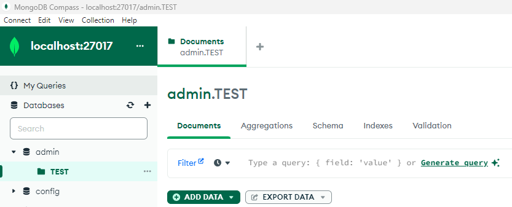

## GET STARTED 🚀

**For doing *Chaos Experiment* on *Mongo DB* we would need below items to be configured in our Windows Machine**

### Configuring Python :
---
- Python 3 or higher 👉 [Click here to download ⬇️](https://www.python.org/downloads/)

- Configure pip (The Python Package Manager) 👉 For the installation of required libraries

- Open command prompt / powershell / terminal in the location of this location ( *Chaos-And-GenAI/EXP* ), and execute the below command
```
pip install -r requirements.txt
```

### Mongo DB configuration:
---
For our this project, our target database will be a MongoDB instance for which we are configuring MongoDB.

- Mongo DB Server 👉 [Click here to download ⬇️](https://www.mongodb.com/try/download/community)

- Mongo DB Compass (GUI for interacting with MongoDB instance) 👉 [Click here to download ⬇️](https://www.mongodb.com/try/download/compass)
<br>
> ***NOTE** : With the new latest version of MongoDB, Compass will be automatically installed with the community server. In that case no need to download Compass again.*

After the installation of MongoDB we can check by executing the below commands whether MongoDB is up and running :

**In Windows :**
```
sc query MongoDB
```

<br>
Now as we have MongoDB configured, now we will create a collection and add a dummy data. We can do it with the help of MongoDB Compass easily. Follow the steps to add a dummy JSON :
<br>
<br>

- **Launch MongoDB Compass and hit CONNECT button**


- **Click on the '+' icon with admin database, and create a collection called 'TEST', and then click on 'Create Collection' button**


---


- **Click on collection 'TEST', and then click on Add Data > Insert Document. Remove whatever is present in the input box, and add any JSON of your choice and click on Insert**


----


<br>


### Running Chaos Experiment
---
*This project is foccussed on creating **Connection Overload** Chaos scenario in MongoDB.*
<br>

#### Steps for simulating the Chaos :
---

1. Click on **00-DEPENDENCY-Checker.bat** file to check if everything is installed properly

2. Click on **01-Data-Collector.bat** to start collecting metrices. Once you click on this two terminals will open parallely. Keep them running as per your requirement of data collection from MongoDB as well as system metrices, before starting the Chaos Experiment.

3.  After that duration keep these 2 terminals running, and start **02-Inject-Chaos.bat** file.
> **Note** : If you want to change the duration of this Chaos Experiment, open the bat file in a notepad or any text editor of your choice, and change the argument value **t=60** as per your required duration

4. Once the Chaos Experiment is stopped, you can wait for some more time before you interrupt the 2 terminals for data collections which we started in **Step 2**, in order to collect some metrices after Chaos Experiment

5. Once the above activities are done, we need to now collate the data and prepare a prompt for GenAI for further analysis. And for that we need to provide some OpenAI account information to the code. Provide your **OpenAI API Key** and **Org ID** in the **config.properties** file.

6. Then double click on **03-Generate-GenAI-Report.bat** file. It will take the logs created in the **LOGS** directory during the Chaos Experiment and prepare a prompt in a text file called **genai_prompt.txt**, and then another logic will consume this text file, and fetch GenAI's output and save it in a **result.md** file in the root directory of this project.

7. **Emailing feature is still in construction🛠️**
